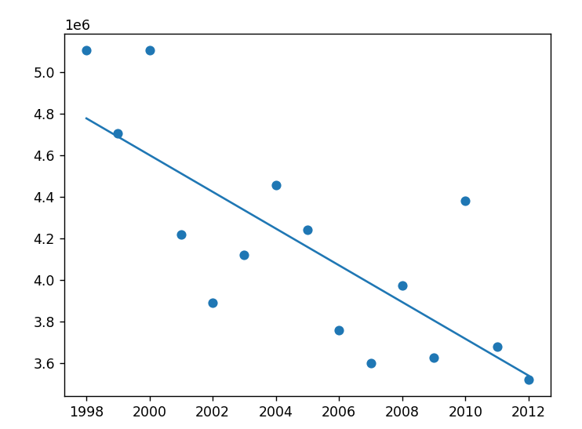
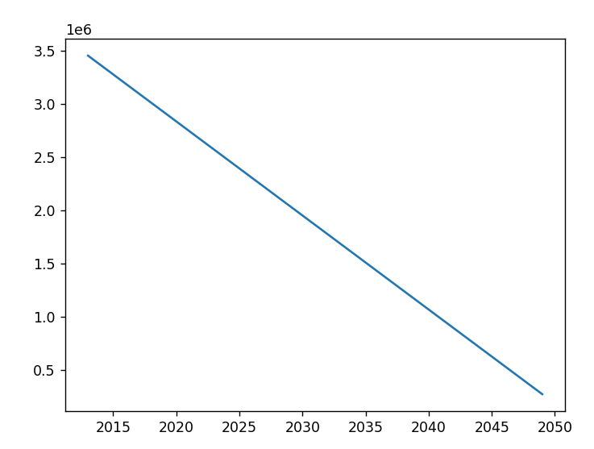

# Predicting Future Honey Production: A Machine Learning Approach Using Linear Regression

This project utilizes a linear regression model to predict the future production of honey up to the year 2050, based on historical data available until 2013. By leveraging Python's powerful libraries like NumPy, Pandas, and Scikit-learn, this analysis projects the trends observed in honey production, which has been in decline.

## How It Works

The model is built using a dataset that contains yearly honey production figures. The data is grouped by year, and the mean total production per year is calculated. This processed data then serves as the input (features) for our linear regression model.

### Here’s a step-by-step breakdown of the process:

#### Data Loading and Processing:
- Load the historical honey production data.
- Group the data by year and calculate the average production for each year.

#### Model Training:
- The features (years) are reshaped into a suitable format for the Scikit-learn library, turning the year data into a column matrix.
- A linear regression model is then fitted with years as the features and total production as the target variable.

#### Prediction and Visualization:
- Future years (2013 to 2050) are generated and reshaped similarly to form the prediction base.
- The model predicts future honey production based on the trained model.
- Visualizations are generated to display both the historical data fitted with the regression line and future predictions.

## Visualizations

The following visualizations are key components of our analysis:

### Historical Data and Regression Line
This plot shows the historical data points along with the regression line fitted over them, illustrating the trend of honey production over the years.

### Future Production Prediction
This plot extends the regression line into future years, showing the predicted decline in honey production up to the year 2050.

