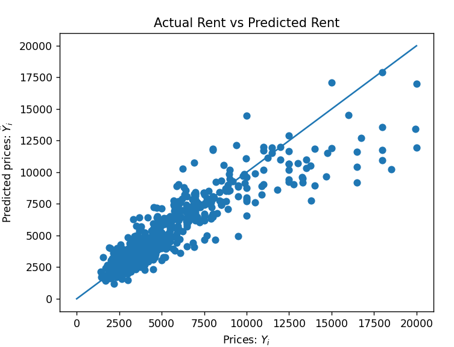

# Manhattan Rent Predictor

## Overview
This Python project uses linear regression to predict rental prices in Manhattan based on features such as the number of bedrooms, square footage, and building amenities. It leverages libraries like pandas and scikit-learn for data handling and model building.

## Dependencies
- Python
- pandas
- matplotlib
- scikit-learn

## Files
- `manhattan.csv`: Contains the dataset.
- `main.py`: Python script for model training and prediction.

## Usage
Install required Python libraries, place the dataset in the same directory as the script, and run `main.py`. The script outputs model scores and a plot comparing actual to predicted rents, and it predicts rent for a specified apartment.

## Model Evaluation
The model uses the R^2 score to assess its accuracy in predicting rental prices.

